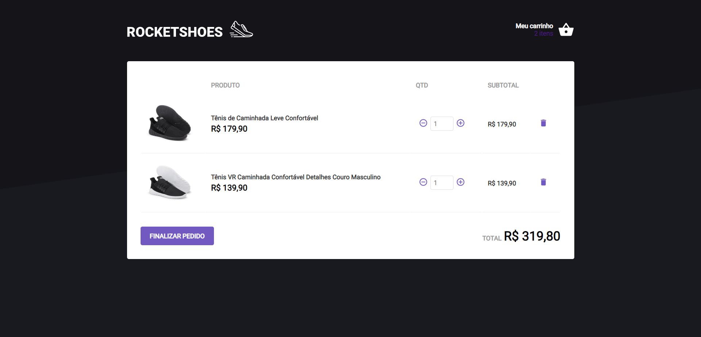

<h1 align="center">
    
</h1>

<h1 align="center">
    
</h1>

<h2 align="center">RocketShoes é uma aplicação criada durante o bootcamp da Rocketseat, onde é nós ensinado o grande poder da arquitetura flux.</h2>

<h2><strong>:satellite:Tecnologias utilizadas*</strong></h2>

<h3>ReactJS  </h3>
<h3>Redux  </h3>
<h3>Redux-Saga  </h3>

---

## 🚀 Telas aplicação 

<p align="center">
	
	
</p>


### Instalando aplicação

Execute o comando ```npm install``` na raiz do projeto para instalar as dependências.
 

Execute também o comando ```npm server``` na raiz para executar a API.
 

Após executado o código acima, execute o comando ```npm start``` na raiz de cada projeto em outro CMD.


 
Dúvidas entre em contato pelo <h4 align="center"> <a href="https://www.linkedin.com/in/marco-antonio-monteiro-de-brito-541ba0144/" target="_blank">Linkedin</a> </h4>

<h4 align="center"> <em>&lt;/&gt;</em> by <a href="https://github.com/marcomonteirobrito" target="_blank">marcomonteirobrito</a> </h4>